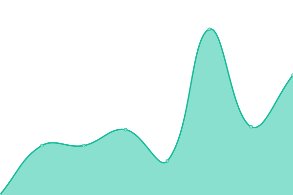
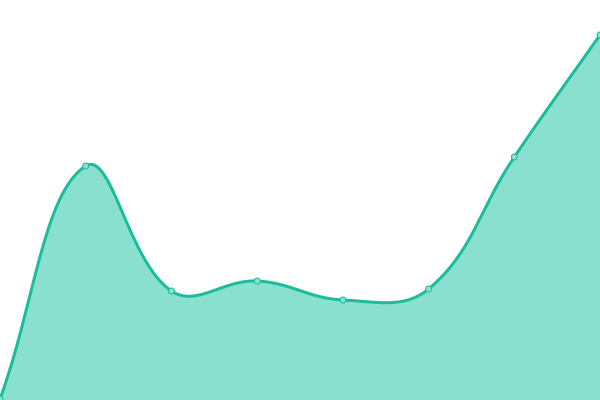

# [📈 Live Status](https://status.graph8.com): <!--live status--> **🟧 Partial outage**

This repository contains the open-source uptime monitor and status page for [Upptime](https://upptime.js.org), powered by [Upptime](https://github.com/upptime/upptime).

With [Upptime](https://upptime.js.org), you can get your own unlimited and free uptime monitor and status page, powered entirely by a GitHub repository. We use [Issues](https://github.com/upptime/upptime/issues) as incident reports, [Actions](https://github.com/asmirGraph8/upptime-status/actions) as uptime monitors, and [Pages](https://status.graph8.com) for the status page.

<!--start: status pages-->
<!-- This summary is generated by Upptime (https://github.com/upptime/upptime) -->
<!-- Do not edit this manually, your changes will be overwritten -->
<!-- prettier-ignore -->
| URL | Status | History | Response Time | Uptime |
| --- | ------ | ------- | ------------- | ------ |
|  [graph8 site](https://graph8.com) | 🟩 Up | [graph8-site.yml](https://github.com/graph8-com/upptime-status/commits/HEAD/history/graph8-site.yml) | 

 587ms
     
 | 

<a href="https://status.graph8.com/history/graph8-site">100.00%</a>
    

|  [UUI](https://uui.graph8.com) | 🟩 Up | [uui.yml](https://github.com/graph8-com/upptime-status/commits/HEAD/history/uui.yml) | 

 220ms
     
 | 

<a href="https://status.graph8.com/history/uui">100.00%</a>
    

|  [Cdp](https://cdp.graph8.com) | 🟥 Down | [cdp.yml](https://github.com/graph8-com/upptime-status/commits/HEAD/history/cdp.yml) | 

 170ms
     
 | 

<a href="https://status.graph8.com/history/cdp">0.00%</a>
    

|  [Events](https://events.flow.graph8.com/health) | 🟩 Up | [events.yml](https://github.com/graph8-com/upptime-status/commits/HEAD/history/events.yml) | 

 188ms
     
 | 

<a href="https://status.graph8.com/history/events">100.00%</a>
    

|  [Schedule](https://schedule.graph8.com/auth/login) | 🟩 Up | [schedule.yml](https://github.com/graph8-com/upptime-status/commits/HEAD/history/schedule.yml) | 

 314ms
     
 | 

<a href="https://status.graph8.com/history/schedule">100.00%</a>
    

<!--end: status pages-->

[**Visit our status website →**](https://status.graph8.com)

## 📄 License

- Powered by: [Upptime](https://github.com/upptime/upptime)
- Code: [MIT](./LICENSE) © [Anand Chowdhary](https://anandchowdhary.com), supported by [Pabio](https://pabio.com)
- Data in the `./history` directory: [Open Database License](https://opendatacommons.org/licenses/odbl/1-0/)
